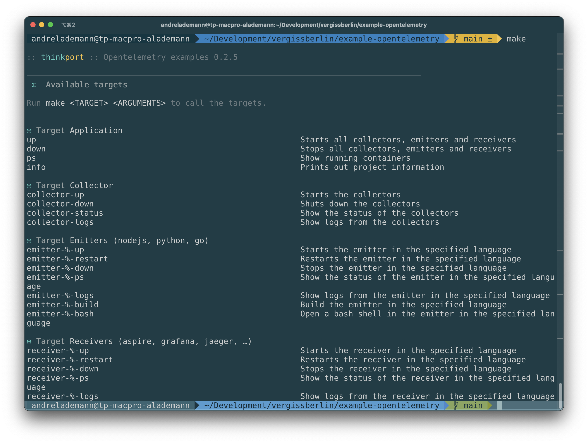

# OpenTelemetry examples

<table>
  <tr>
    <th width="20%" style="padding:0">
      
    </th>
    <td style="background: #f0f8ff;font-size:124%;">
      With these examples you can learn how 
      to use OpenTelemetry in your applications. 
      We have added examples for different languages and exporters. 
      Only checked features are implemented.
   </td>
  </tr>
</table>

---

## Features

> An easy way ro get all open port is also to run `make ps` in the root of the
> repository after you have started the services with `make up`.

### Emitters (SDKs)

| SDK    | Status | URL                                    | Docs                                |
|--------|--------|----------------------------------------|-------------------------------------|
| dart   | ✔️     | <http://0.0.0.0:8051/>                 | [code](examples/emitters/dart/dice) |
| go     |        |                                        |                                     |
| java   |        |                                        |                                     |
| nodejs | ✔️     | <http://0.0.0.0:8030/?rolls=12>        | [code](examples/emitters/nodejs)    |
| python | ✔️     | <http://0.0.0.0:8050/rolldice?roll=12> | [code](examples/emitters/python)    |
| rust   |        |                                        |                                     |

### Collectors

| Service                         | Status | Protocol | URL                   |
|---------------------------------|--------|----------|-----------------------|
| OpenTelemetry Collector         | ✔️     | gRPC     | `grpc://0.0.0.0:4318` |
| OpenTelemetry Collector Contrib | ✔️     | gRPC     | `grpc://0.0.0.0:5318` |

### Processors

| Processor | Status |
|-----------|--------|
| Batch     |        |
| Filter    |        |

### Exporters

| Service     | Status | URL |
|-------------|--------|-----|
| Kafka       |        |     |
| MQTT        |        |     |
| Solace      |        |     |
| File system |        |     |

### Receivers

| Service            | Status | URL                    |
|--------------------|--------|------------------------|
| Aspire             | ✔️     | <http://0.0.0.0:18888> |
| AWS X-Ray          |        |                        |
| DataDog            |        |                        |
| Dynatrace          |        |                        |
| Google Cloud Trace |        |                        |
| Grafana            | ✔️     | <http://0.0.0.0:3000>  |
| Honeycomb          |        |                        |
| Instana            |        |                        |
| Jaeger             | ✔️     | <http://0.0.0.0:16686> |
| Lightstep          |        |                        |
| New Relic          |        |                        |
| OpenCensus         |        |                        |
| Prometheus         |        |                        |
| Sentry             |        |                        |
| SignalFx           |        |                        |
| Wavefront          |        |                        |

## Getting started

1. Clone the repository
2. Choose the language you want to learn
3. Start the collector and receiver locally with Docker
    1. `make collectors-up`
    2. `make receiver-up`
4. Run the example in the language you have chosen (see README.md in the
   language folder)

### Command line interface

To make it easy as possible to run the examples, we have added a command line
interface.

You can start all examples with one command. Just run `make up` in the root of
the repository. Or you can start the examples individually
with `make emitter-<language>-up` or `make receiver-<language>-up`.

## Contributing

If you want to contribute to this repository, please read
the [CONTRIBUTING.md](CONTRIBUTING.md) file.
