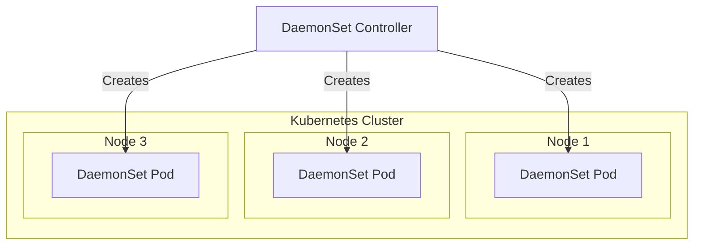

# Otel Collector Kubernetes DaemonSet with Datadog-like configuration

This example shows how to deploy the OpenTelemetry Collector as a Kubernetes 
DaemonSet with a Datadog-like configuration. The configuration includes
receivers, processors, and exporters.

## What is a DaemonSet in Kubernetes?

A DaemonSet is a special kind of Kubernetes Deployment that ensures that a
specific Pod runs on every Node in the cluster.

## Why?

DaemonSets are often used for system-level services that need to run on all
nodes, such as:

- [ ] Log collectors (e.g., Fluentd, Filebeat)
- [ ] Monitoring agents (e.g., Prometheus Node Exporter, OpenTelemetry Collector)
- [ ] Network services (e.g., CNI plugins like Calico or Cilium)

## How does a DaemonSet differ from a Deployment?

| Feature                    | DaemonSet                    | Deployment            |
|----------------------------|------------------------------|-----------------------|
| Where do Pods run?         | On every Node                | Kubernetes decides    |
| When are new Pods created? | Whenever a new Node is added | When desired          |
| Scaling                    | Automatically with Nodes     | Manually via replicas |

