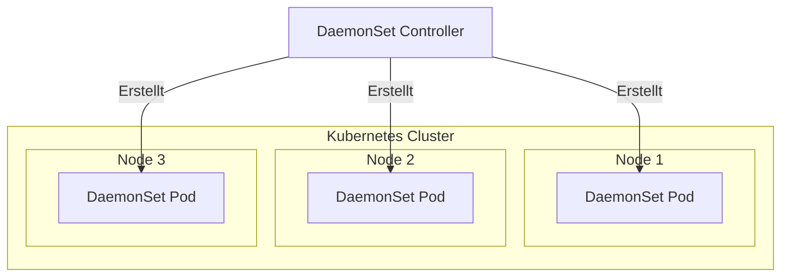

# OTel collector as a Kubernetes DaemonSet

This example shows how to deploy the OpenTelemetry Collector as a Kubernetes DaemonSet.

## Was ist ein DaemonSet in Kubernetes?
Ein DaemonSet ist eine spezielle Art von Kubernetes-Deployment, die sicherstellt, dass ein bestimmter Pod auf jedem Node im Cluster läuft.

## Wofür?
DaemonSets werden häufig für systemnahe Services genutzt, die auf allen Nodes laufen müssen, z. B.:

- [ ] Log-Collector (z. B. Fluentd, Filebeat)
- [ ] Monitoring-Agenten (z. B. Prometheus Node Exporter, OpenTelemetry Collector)
- [ ] Netzwerkdienste (z. B. CNI-Plugins wie Calico oder Cilium)


## Wie unterscheidet sich ein DaemonSet von einem Deployment?

| Feature |	DaemonSet |	Deployment|
| --- | --- | --- |
|Wo laufen die Pods?|	Auf jedem Node	Kubernetes entscheidet, wo
Wann werden neue Pods erstellt?	Immer, wenn ein neuer Node hinzukommt	| Wenn gewünscht
Skalierung	Automatisch mit Nodes	Manuell über replicas:


⸻

### Beispiel: OpenTelemetry Collector als DaemonSet

Falls du den OpenTelemetry Collector auf allen Nodes laufen lassen willst:

```yaml
apiVersion: apps/v1
kind: DaemonSet
metadata:
  name: otel-collector-daemonset
  namespace: monitoring
spec:
  selector:
    matchLabels:
      app: otel-collector
  template:
    metadata:
      labels:
        app: otel-collector
    spec:
      containers:
        - name: otel-collector
          image: otel/opentelemetry-collector:latest
          args: ["--config=/etc/otel/config.yaml"]
          volumeMounts:
            - name: config
              mountPath: /etc/otel
      volumes:
        - name: config
          configMap:
            name: otel-collector-config
```

###💡 Erklärung

-	Kubernetes startet den OTel Collector auf jedem Node.
-	Falls ein neuer Node zum Cluster hinzukommt, wird dort automatisch auch 
     ein Pod erstellt.


### DaemonSet verwalten

Alle DaemonSets im Cluster anzeigen:

```shell
kubectl get daemonsets -A
```

Details eines DaemonSets anzeigen:

```shell
kubectl describe daemonset otel-collector-daemonset -n monitoring
```

Laufende DaemonSet-Pods sehen:

```shell
kubectl get pods -o wide -n monitoring
````

### DaemonSet löschen

```shell
kubectl delete daemonset otel-collector-daemonset -n monitoring
```

### Wann solltest du ein DaemonSet nutzen?

- [ ] Wenn du sicherstellen willst, dass ein Pod auf allen Nodes läuft
- [ ] Für Node-spezifische Anwendungen (Monitoring, Logging, Networking)
- [ ] Falls dein Service direkt mit dem Hostsystem interagieren muss

Falls du Pods flexibel auf Nodes verteilen möchtest, wäre ein Deployment oder StatefulSet besser.

