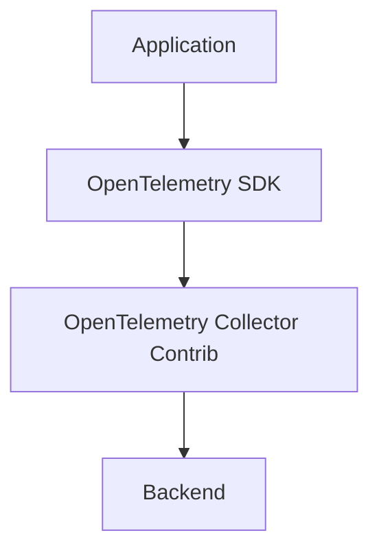

# OpenTelemetry Dart/Flutter Example

[](https://stand-with-ukraine.pp.ua)

This example demonstrates how to use OpenTelemetry to instrument a simple 
Flutter application.

## Prerequisites

1. Install [Docker](https://docker.com/)
2. Install [Dart](https://dart.dev/) and [Flutter](https://flutter.dev/) 
3. Install [Chrome Browser](https://www.google.com/chrome/)

## Usage

1. Start the OpenTelemetry Collector by running
    ```bash make 
    make collector-up
    ```
2. Start the Jaeger backend by running
    ```bash make 
    make receiver-jaeger-up
    ```
    or if you prefer to use Aspire:
    ```bash make
    make receiver-aspire-up
    ```
3. Start the Flutter app by running
    ```bash
    flutter run -d macos
    ```
4. Open the Jaeger UI at [http://localhost:16686](http://localhost:16686) or the Aspire UI at [http://localhost:18888](http://localhost:18888)
5. To generate traces, open the Chrome Browser with url http://0.0.0.0:8051 in
   insecure mode by running the following command on macOS:
    ```bash
    open -na "Google Chrome" --args --user-data-dir=/tmp/foo --disable-web-security --ignore-certificate-errors http://0.0.0.0:8051 
    ```

## Features

- [x] Collect metrics from the Flutter app
- [x] Collect logs from the Flutter app
- [ ] Collect traces from the Flutter app
- [ ] Collect metrics with custom attributes from the Flutter app
- [ ] Offline capabilities to send traces to the OpenTelemetry Collector



## Run application

```bash
make emitter-dart-up
```

## View traces

1. Go to the [Jaeger UI](http://localhost:16686).
2. Look for traces with the service name `dart-button`.

---
## Documentation

### Extension - File Storage

- <https://github.com/open-telemetry/opentelemetry-collector-contrib/tree/main/extension/storage/filestorage>
- <https://pkg.go.dev/github.com/open-telemetry/opentelemetry-collector-contrib/extension/storage/filestorage#section-readme>

### Exporter Helper

- <https://github.com/open-telemetry/opentelemetry-collector/tree/main/exporter/exporterhelper>

```text
                                                              ┌─Consumer #1─┐
                                                              │    ┌───┐    │
                              ──────Deleted──────        ┌───►│    │ 1 │    ├───► Success
        Waiting in channel    x           x     x        │    │    └───┘    │
        for consumer ───┐     x           x     x        │    │             │
                        │     x           x     x        │    └─────────────┘
                        ▼     x           x     x        │
┌─────────────────────────────────────────x─────x───┐    │    ┌─Consumer #2─┐
│                             x           x     x   │    │    │    ┌───┐    │
│     ┌───┐     ┌───┐ ┌───┐ ┌─x─┐ ┌───┐ ┌─x─┐ ┌─x─┐ │    │    │    │ 2 │    ├───► Permanent -> X
│ n+1 │ n │ ... │ 6 │ │ 5 │ │ 4 │ │ 3 │ │ 2 │ │ 1 │ ├────┼───►│    └───┘    │      failure
│     └───┘     └───┘ └───┘ └───┘ └───┘ └───┘ └───┘ │    │    │             │
│                                                   │    │    └─────────────┘
└───────────────────────────────────────────────────┘    │
   ▲              ▲     ▲           ▲                    │    ┌─Consumer #3─┐
   │              │     │           │                    │    │    ┌───┐    │
   │              │     │           │                    │    │    │ 3 │    ├───► (in progress)
 write          read    └─────┬─────┘                    ├───►│    └───┘    │
 index          index         │                          │    │             │
                              │                          │    └─────────────┘
                              │                          │
                          currently                      │    ┌─Consumer #4─┐
                          dispatched                     │    │    ┌───┐    │     Temporary
                                                         └───►│    │ 4 │    ├───►  failure
                                                              │    └───┘    │         │
                                                              │             │         │
                                                              └─────────────┘         │
                                                                     ▲                │
                                                                     └── Retry ───────┤
                                                                                      │
                                                                                      │
                                                   X  ◄────── Retry limit exceeded ───┘
```
