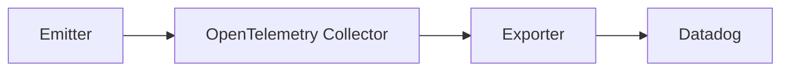

# Receivers - datadog

This receiver example with Datadaog is part of the [Thinkport OpenTelemetry Examples](../../) project.

This example emittes a trace from an emitter, an pass it through an [OpenTelemetry collector](https://https://opentelemetry.io/docs/collector/), through an exporter to datadog:

## Status

| Service | Status |         URL         |
| ------- | ------ | ------------------- |
| Datadog | 👩‍💻    | <http://datadog.eu> |

## Getting started

1. Create an account on [Datadog](https://www.datadoghq.com/)
2. Get your API key
3. Clone this repository
4. Start the receiver locally with Docker
    1. `make receiver-up`
    2. `make receiver-logs`
5. Send traces to the receiver

## Contributing

If you want to contribute to this project, please read the [CONTRIBUTING.md](CONTRIBUTING.md) file.
